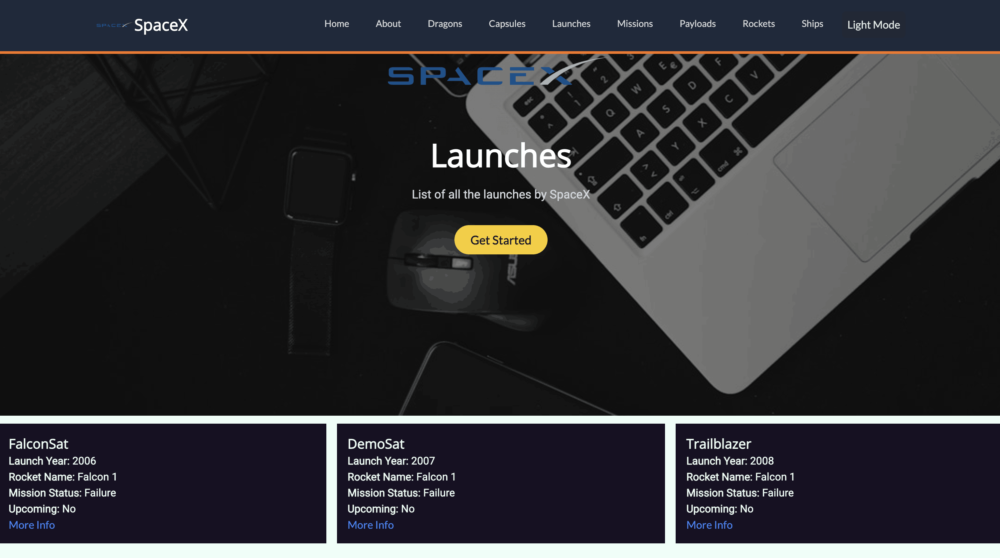
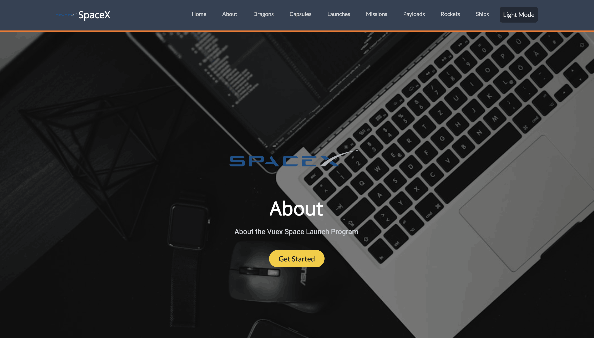
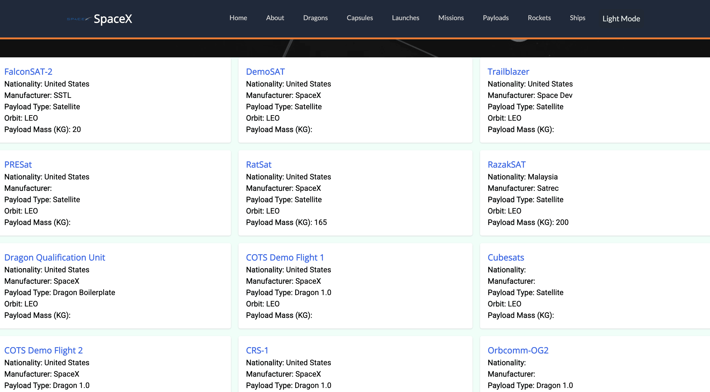
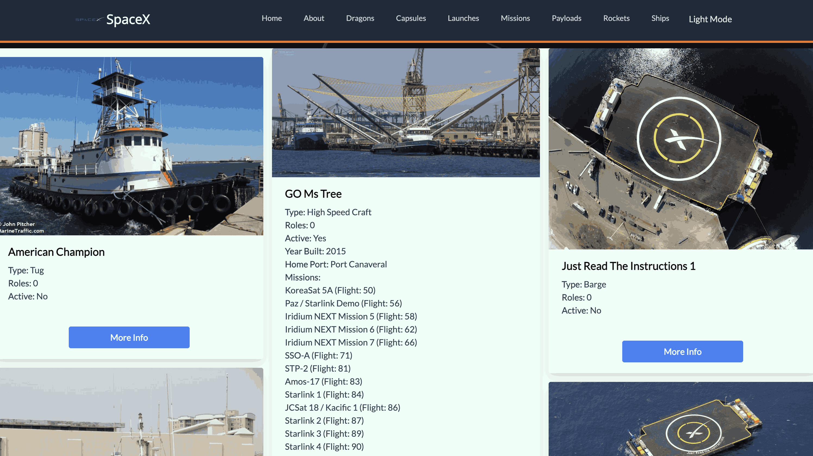

# Vue SpaceX LaunchPad, a database App using SpaceX API - Vue JS and Tailwind CSS ⚡️


## Project Briefing



This uses open API provided by SpaceX which is related to missions they've launched over the years. This displays details related to it through a beautiful user interface and filters provided. This uses Vue-Tailwind UI library in Vue for UI components which are powered by Tailwind CSS.

Tried to convert the app to Vue 3 using Vite but just came to know that the UI library used in this 'vue-tailwind' is no longer maintained and is not supported for Vue 3. In place of this, Headless UI can be used.

The project is available for demo at https://vue-spacex-launchpad.vercel.app

Made with ❤️ by **[@apfirebolt](https://github.com/Apfirebolt/)**
## Features

- Makes use of SpaceX public API to search for launches and filter them based on various parameters. 
- Vue-Tailwind components used for Tables and Modals inside the application. 

## Built With

* [Vue](https://vuejs.org//)
* [Vue-Tailwind](https://www.vue-tailwind.com//)
* [Tailwind CSS](https://tailwindcss.com//)

## Project setup

Simply install node modules for the app and run the serve script.

```
npm install
npm run dev
```

For production, run the build npm command and serve the static files through a production or development server.

```
npm run build
npm start
```

## Project Screenshots

Please find some of the screenshots of the application. Below is the screenshot of the Home Page.

  
  
  
  


## Testing

Testing using Vitest and vue-test-utils for Vue 3.

```
npm i vitest @#vue/test-utils@next
npm i happy-dom
```

Add test script in your package.json file

```
"test": "vitest"
```

Happy Dom package would help mimicking the browser environment inside Node.

